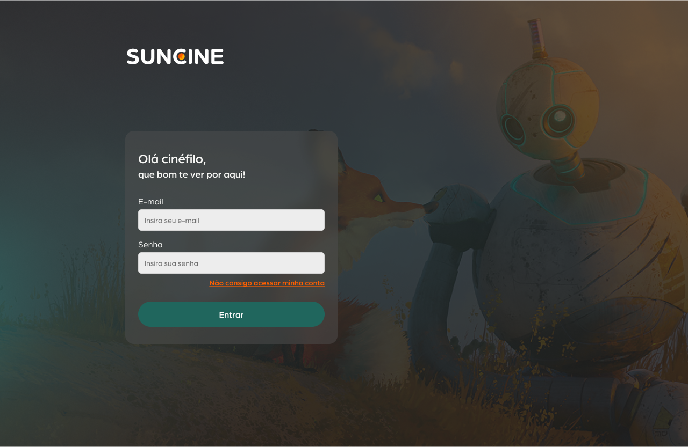
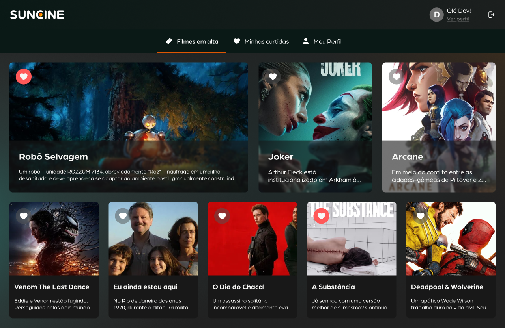
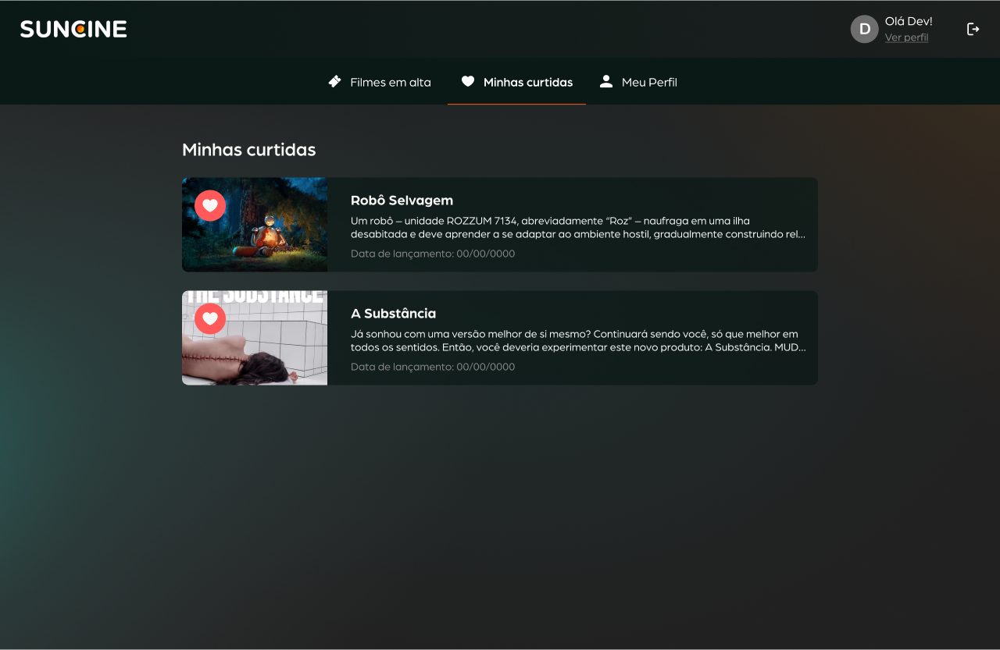
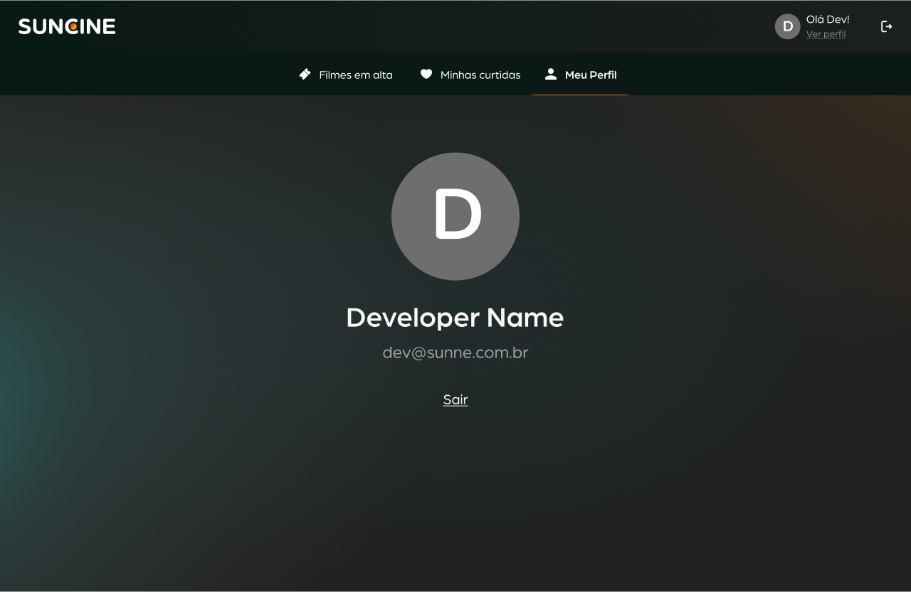

  

 

  
  
  
  
  
  
  

# 🎬 SunCine
O SunCine é uma plataforma de filmes projetada para fornecer informações detalhadas sobre os filmes mais populares, além de permitir que os usuários curtam seus filmes favoritos e gerenciem preferências pessoais.

## 📔 Sumário
- 🎯 Desafio
  - 📝 Documentação
  - 🗂️ Entrega do Código
  - 🔍 Ferramentas e Suporte
  - 📢 Apresentação
  - 📅 Datas e Dúvidas
- 📋 Requisitos
- ⚠️ Possíveis Problemas e Soluções
- 🔗 Links Úteis
- 🚀 Iniciando o Projeto
  - 🔐 Informações do Usuário
- 🛠️ Comandos Úteis
- 🖼️ Referência

## 🎯 Desafio
Leia a descrição do desafio em: [FULL_PL](./FULL_PL.md)

### 📝 Documentação
Caso seja necessário algum passo adicional para rodar o projeto *(além do que já foi configurado)*, isso deve ser `descrito` no arquivo [DOCUMENTATION.md](./DOCUMENTATION.md).

**‼️ Observação:**  
> Qualquer configuração extra necessária para executar o projeto que não esteja informada no [DOCUMENTATION.md](./DOCUMENTATION.md) resultará na desqualificação automática do desafio.

### 🗂️ Entrega do Código
- O código deve ser colocado em um **repositório público no GitHub**.
- O link do repositório deve ser enviado conforme descrito no e-mail recebido junto com este desafio.
- Apenas os commits realizados **até a data prevista no e-mail** serão válidos. O avaliador irá verificar o histórico de commits.

### 🔍 Ferramentas e Suporte

Você pode utilizar qualquer ferramenta que facilite o desenvolvimento, como _ChatGPT_, _pesquisas na internet_, ou até mesmo _consultar colegas mais experientes_. Isso não será um problema.

Porém, você será questionado sobre o código desenvolvido e deve ser capaz de explicá-lo detalhadamente. Por isso:
- Tenha cuidado com auxílios automáticos ou externos.
- Mais importante do que o resultado final é **demonstrar o entendimento** de por que algo foi feito de determinada forma.

### 📢 Apresentação
Após a entrega, uma apresentação será agendada para que você demonstre o seu trabalho. O formato será:
- **20 minutos** para apresentar o que foi desenvolvido.
- **10 a 30 minutos** de perguntas feitas pelo entrevistador. As perguntas podem abordar:
  - Seu raciocínio para resolver determinados problemas.
  - Seu fluxo de desenvolvimento.

> **Nota:** Caso você prefira, pode montar uma apresentação para facilitar sua explicação. Isso não é obrigatório, mas pode ajudar a organizar e esclarecer melhor as suas ideias.

> 💡 **Dica:** Tente explicar conceitos mais gerais, como pensou para resolver algum problema, quais ferramentas utlizou, como foi seu fluxo de trabalho. O Entrevistador já vai ter lido seu código antes da avaliação.

### 📅 Datas e Dúvidas
As datas para entrega e apresentação estão descritas no e-mail que você recebeu junto com este desafio. Caso tenha dúvidas, entre em contato pelo e-mail informado.

## 📋 Requisitos
Para executar este projeto, é necessário ter as seguintes ferramentas instaladas e configuradas no ambiente de desenvolvimento:
- [Node.js (v20.x.x)](https://nodejs.org/): A base para rodar o backend do projeto.
- [pnpm](https://pnpm.io/): Gerenciador de pacotes utilizado no monorepo para instalação e gerenciamento das dependências.
- [Docker](https://www.docker.com/): Ferramenta para criar e gerenciar containers.
- [Docker Compose](https://docs.docker.com/compose/): Utilizado para gerenciar os containers do banco de dados (MongoDB) e da ferramenta de gerenciamento de banco de dados (Mongo Express).
- [Biome](https://biomejs.dev/): Code formatter utilizado para padronizar o estilo do código. Você pode configura o biome na sua IDE utilizando suas [extensões](https://biomejs.dev/guides/editors/first-party-extensions/).
- [TMDB Api Token](https://developer.themoviedb.org/reference/intro/authentication): Cadastre-se no TMDB e gere um token para autenticação na API. Esse token será necessário para que a aplicação funcione corretamente.

### ⚠️ Possíveis Problemas e Soluções
**1. Gerenciador de Pacotes**
  - **Problema**: Outro gerenciador de pacotes foi utilizado no lugar do `pnpm`.
  - **Solução**:
    1. Apague os diretórios _node_modules/_, _projects/back/node_modules/_, _projects/front/node_modules/_, e o arquivo lock do gerenciador utilizado anteriormente.
    2. Execute o comando: `pnpm i`

**2. Banco de dados não conectando**
  - **Problema**: Backend acusando que não encontra o banco de dados.
  - **Solução**:
    1. Verifique se o **Docker** e o **Docker Compose** estão instalados e funcionando corretamente.
    2. Inicie os containers do banco de dados com o comando: `pnpm run db:start`

**3. Backend Retornando Erro 500**
  - **Problema**: O backend retorna erro 500 devido à falta do `TMDB_TOKEN`
  - **Solução**: 
    1. Certifique-se de que o token TMDB foi gerado e configurado corretamente.
    2. Verifique se o arquivo `projects/back/.env` contém o valor correto para a variável `TMDB_TOKEN`.

**4. Erro ao Comitar ou Enviar Código para o GitHub**
  - **Problema**: O programa não permite criar commits ou enviar código para o GitHub.
  - **Solução**: Execute o comando `pnpm run lint`. Esse comando irá ajustar o código de acordo com as regras configuradas no Biome, corrigindo os problemas de formatação.

**5. MongoServerError: Authentication failed**
  - **Problema**: O Backend não conecta ao Mongo.
  - **Solução**: Mudar a variável de ambiente `MONGO_HOST` no `.env` para `localhost`

## 🔗 Links Úteis
- [React.js](https://react.dev/): Para o desenvolvimento da aplicação.
- [Tailwind](https://tailwindcss.com/): Para estilização da interface de forma eficiente.
- [pnpm Filtering](https://pnpm.io/filtering): Para gerenciar e adicionar bibliotecas específicas ao projeto.
- [Documentação da API](http://localhost:3000/docs): Disponível em [http://localhost:3000/docs](http://localhost:3000/docs).
- [Vitest](https://vitest.dev/): Para testes unitários e de integração na aplicação.

> **Nota:** Acesse a documentação da API apenas com o backend ativo.

## 🚀 Iniciando o projeto
1. **Verifique os Requisitos:** Certifique-se de que todas as ferramentas listadas na seção de requisitos estão instaladas corretamente.
1. **Configure o Backend:**
No diretório `projects/back`, copie o arquivo `.env.example` e renomeie-o para `.env`.
Adicione o token gerado no TMDB na variável `TMDB_TOKEN` no arquivo `.env`.
1. **Instale as Dependências:** Execute o comando: `pnpm i`
1. **Inicie o Banco de Dados:**
Verifique se o Docker está em execução na sua máquina.
Inicie os containers do banco de dados com o comando `pnpm run db:start`
1. **Inicie o Backend:** Rode o comando `pnpm run dev:back`
1. **Inicie o Frontend:** Rode o comando `pnpm run dev:front`
1. **Ou Use o Comando Único:** Caso prefira iniciar o banco de dados, o backend e o frontend de uma só vez, execute: `pnpm run dev`
1. **🎉 Bora Codar!**

Agora que tudo está configurado, é hora de colocar a mão na massa e brilhar! ✨💻

Divirta-se desenvolvendo o desafio e mostre suas habilidades! 🚀

> 💡 Observação: Você precisará instalar o **TailwindCSS** e outras bibliotecas adicionais que considerar necessárias para o desenvolvimento do frontend.

#### 🔐 Informações do Usuário
| Info | Data |
|---|---|
| **Login** | admin@email.com |
| **Password** | Admin@123 |

## 🛠️ Comandos Úteis
| Utilidade | Data |
|---|---|
| Iniciar o banco de dados e todos sub-projetos | `pnpm run dev` |
| Instalar todas as dependências | `pnpm i` |
| Iniciar o banco de dados | `pnpm run db:start` |
| Iniciar o backend | `pnpm run dev:back` |
| Iniciar o frontend | `pnpm run dev:front` |
| Instalar uma dependência específica no front | `pnpm add -D --filter=@sunne-test/front <dependencia>` |
| Rodar testes no back | `pnpm run test` |

> Nota: Certifique-se de rodar o comando de inicialização do banco de dados antes de iniciar o backend.

> 💡 Observação: Use o último comando para instalar bibliotecas adicionais no frontend, como o TailwindCSS, caso necessário.

## 🖼️ Referência
O link para o **Figma** com o design de referência foi enviado no e-mail juntamente com este desafio. Utilize-o como base para o desenvolvimento das páginas.

Abaixo estão as capturas de tela das páginas:

#### Login

#### Top 10

#### Likes

#### Perfil

